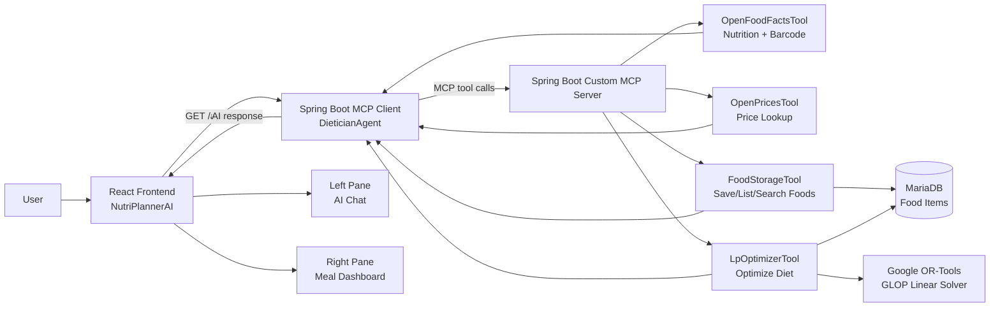
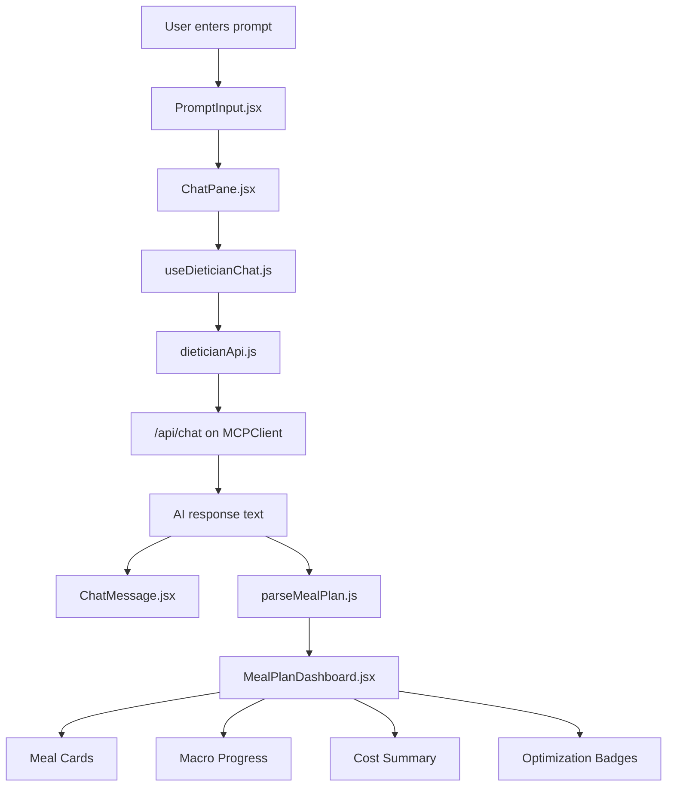

# NutriPlannerAI

## AI Meal Planning and Diet Optimization System

**NutriPlannerAI** is an AI-assisted meal planning application that helps users generate practical breakfast, lunch, and dinner plans from natural language prompts. The system combines a React frontend, a Spring Boot AI/MCP client, a custom Spring Boot MCP tool server, OpenFoodFacts nutrition data, Open Prices price lookup, MariaDB food storage, and Google OR-Tools Linear Programming optimization.

The purpose of the application is simple:

> A user tells NutriPlannerAI their diet goal, such as calories, protein, budget, food preferences, or vegetarian/non-vegetarian needs. NutriPlannerAI gathers food nutrition and price data, saves the foods, runs an optimizer, and returns a clear meal plan with breakfast, lunch, dinner, daily totals, cost, and optimization status.

The final user experience is designed as a two-pane web app:

```text
┌──────────────────────────────────────────────────────────────────────────────┐
│                              NutriPlannerAI                                 │
│                    AI Meal Planning + Diet Optimization                      │
├─────────────────────────────────────┬────────────────────────────────────────┤
│ Left Pane                           │ Right Pane                             │
│ AI Chat                             │ Meal Plan Dashboard                    │
│                                     │                                        │
│ User prompt                         │ Today's Optimized Meal Plan            │
│ AI response                         │ Breakfast card                         │
│ Conversation ID                     │ Lunch card                             │
│ Follow-up questions                 │ Dinner card                            │
│                                     │ Macro progress bars                    │
│                                     │ Macro distribution chart               │
│                                     │ Cost summary                           │
│                                     │ Optimization status badges             │
└─────────────────────────────────────┴────────────────────────────────────────┘
```

---

## 1. Executive Summary

NutriPlannerAI is a full-stack AI meal planning system. It is not just a static diet calculator. It uses an AI agent to understand the user's request, select suitable foods, retrieve nutrition information, estimate or fetch prices, store food records, and call a mathematical optimizer.

The system is designed to answer prompts like:

```text
Create a vegetarian 2800 calorie meal plan with at least 120g protein.
Use affordable foods, get nutrition from OpenFoodFacts, estimate prices if needed,
run optimization, and give me breakfast, lunch, dinner, daily totals, and tools used.
```

The application should respond with something practical:

```text
Breakfast:
- Oats: 90g
- Milk: 300ml
- Banana: 1 medium
- Peanut butter: 20g

Lunch:
- Rice: 260g cooked
- Lentils: 220g cooked
- Greek yogurt: 170g
- Vegetables: 150g

Dinner:
- Pasta: 220g cooked
- Tofu: 180g
- Vegetables: 200g

Daily totals:
- Calories: 2810 kcal
- Protein: 123g
- Carbs: 365g
- Fat: 82g
- Fiber: 31g
- Estimated cost: $13.80 CAD
```

The right pane of the frontend turns this response into a visual dashboard, so the user does not need to read a long AI message to understand what to eat.

---

## 2. High-Level Technologies

### 2.1 ReactJS

ReactJS is used for the frontend web application.

Main responsibilities:

- Display the NutriPlannerAI interface.
- Show the two-pane layout.
- Let the user enter diet prompts.
- Send prompts to the Spring Boot MCP Client.
- Display the full AI conversation on the left.
- Display a structured meal dashboard on the right.
- Show meal cards, nutrition progress, cost cards, and optimization badges.

React does not run AI or optimization directly. It is the user interface layer.

---

### 2.2 Spring Boot MCP Client

The MCP Client is the AI-facing backend. It exposes REST endpoints that the React frontend calls.

Main responsibilities:

- Receive user prompts from React.
- Maintain conversation history.
- Build a strong DieticianAgent prompt.
- Connect the AI model to MCP tools.
- Call the custom MCP server tools.
- Return the AI response to React.

Typical endpoints:

```text
GET /api/chat
GET /api/history
GET /api/health
```

The React app calls:

```text
GET http://localhost:8085/api/chat?question=...&conversationId=...
```

---

### 2.3 Spring Boot Custom MCP Server

The custom MCP server exposes backend tools to the AI agent.

Main responsibilities:

- Search nutrition data using OpenFoodFacts.
- Retrieve nutrition facts and product barcode/product code.
- Get price records from Open Prices.
- Save foods into MariaDB.
- List and search saved foods.
- Run Linear Programming optimization using Google OR-Tools.

This server is a **STDIO MCP Server**, meaning it is launched as a process and communicates through standard input/output using MCP protocol messages.

---

### 2.4 Google OR-Tools

Google OR-Tools is used for the Linear Programming diet optimization model.

Main responsibility:

- Select daily quantities of foods.
- Satisfy nutrition constraints.
- Respect food min/max quantity bounds.
- Minimize estimated daily cost.

Solver used:

```java
MPSolver solver = MPSolver.createSolver("GLOP");
```

GLOP is a linear programming solver.

---

### 2.5 MariaDB

MariaDB stores food items after nutrition and price information is collected.

Stored food data includes:

- Food name
- Generic name
- Brand
- Barcode/product code
- Package size
- Nutrition per 100g
- Price
- Cost per 100g
- Minimum grams
- Maximum grams

The optimizer does not receive full food objects from the AI directly. It receives `foodIds`, then reads the full food records from MariaDB.

---

### 2.6 OpenFoodFacts

OpenFoodFacts is used as the nutrition/product information source.

NutriPlannerAI uses OpenFoodFacts to find:

- Product name
- Brand
- Barcode/product code
- Calories
- Protein
- Carbs
- Fat
- Fiber
- Serving/package information

This replaces the earlier OpenNutrition concept. The current design uses **OpenFoodFactsTool**.

---

### 2.7 Open Prices

Open Prices is used for price records by barcode/product code.

Important note:

- Open Prices may not always return prices.
- It is crowdsourced.
- If no price is available, NutriPlannerAI can use a clearly labeled estimated fallback price.

---

## 3. Big Picture Architecture

### 3.1 Full System Flow

```text
User
  │
  │ enters diet goal
  ▼
React Frontend: NutriPlannerAI
  │
  │ HTTP request: /api/chat
  ▼
Spring Boot MCP Client: DieticianAgent
  │
  │ Builds AI prompt with conversation history
  │ Connects AI to MCP tools
  ▼
Custom Spring Boot MCP Server
  │
  ├── OpenFoodFactsTool
  │     └── nutrition facts + barcode/product code
  │
  ├── OpenPricesTool
  │     └── price records by barcode/product_code
  │
  ├── FoodStorageTool
  │     └── save/list/search foods in MariaDB
  │
  └── LpOptimizerTool
        └── Google OR-Tools LP optimization
              │
              ▼
        Optimized daily food quantities
              │
              ▼
Spring Boot MCP Client
  │
  │ AI converts quantities into meals
  ▼
React Frontend
  │
  ├── Left pane: full AI chat response
  └── Right pane: visual breakfast/lunch/dinner dashboard
```

---

### 3.2 Graphical Architecture Diagram



---

## 4. Frontend: NutriPlannerAI React App

### 4.1 Frontend Purpose

The React frontend is the user's main interface.

It should make the system feel like an AI diet planning dashboard, not just a chatbot.

The UI has two primary panes:

1. **Left Pane: AI Chat**
2. **Right Pane: Meal Plan Dashboard**

---

### 4.2 App Title

The application title is:

```text
NutriPlannerAI
```

Subtitle:

```text
AI Meal Planning + Diet Optimization
```

The title appears at the top of the web app.

---

### 4.3 Left Pane: AI Chat

The left pane is for conversation.

It shows:

- Conversation ID
- User prompt
- AI response
- Error messages
- Loading state
- Follow-up interaction

Example:

```text
AI Chat
Tell NutriPlannerAI what diet you want

User:
Create a vegetarian 2800 calorie meal plan with at least 120g protein...

NutriPlannerAI:
I created a vegetarian meal plan that meets your calorie and protein requirements...
```

The left pane is useful because it shows the reasoning and text explanation from the AI.

---

### 4.4 Right Pane: Meal Plan Dashboard

The right pane is a structured visual representation of the result.

It should show:

- Today's optimized meal plan summary
- Breakfast card
- Lunch card
- Dinner card
- Daily macro progress
- Macro distribution chart
- Cost breakdown
- Optimization status
- Badges such as `RELAXED OPTIMIZATION` or `PRICE ESTIMATED`

Example layout:

```text
┌─────────────────────────────────────────────┐
│ Today's Optimized Meal Plan                 │
│ 2,810 kcal   123g protein   $13.80          │
│ [RELAXED OPTIMIZATION] [PRICE ESTIMATED]    │
└─────────────────────────────────────────────┘

┌───────────────────────┐  ┌───────────────────────┐
│ Breakfast             │  │ Macro Progress         │
│ Oats - 90g            │  │ Calories: 2810/2800    │
│ Milk - 300ml          │  │ Protein: 123/120g      │
│ Banana - 1 medium     │  │ Carbs: 365/400g        │
│ Peanut butter - 20g   │  │ Fat: 82/90g            │
└───────────────────────┘  └───────────────────────┘

┌───────────────────────┐  ┌───────────────────────┐
│ Lunch                 │  │ Macro Distribution     │
│ Rice - 260g cooked    │  │ Carbs 52%              │
│ Lentils - 220g cooked │  │ Protein 18%            │
│ Greek yogurt - 170g   │  │ Fat 30%                │
└───────────────────────┘  └───────────────────────┘

┌───────────────────────┐  ┌───────────────────────┐
│ Dinner                │  │ Estimated Daily Cost   │
│ Pasta - 220g cooked   │  │ Breakfast: $2.45       │
│ Tofu - 180g           │  │ Lunch: $5.10           │
│ Vegetables - 200g     │  │ Dinner: $6.25          │
└───────────────────────┘  └───────────────────────┘
```

---

### 4.5 Badge Explanation

A badge is a small visual label that quickly communicates status.

Examples:

```text
[OPTIMAL]
[RELAXED OPTIMIZATION]
[PRICE ESTIMATED]
[APPROXIMATE PLAN]
[HIGH PROTEIN]
```

Badge meanings:

| Badge | Meaning |
|---|---|
| `OPTIMAL` | The LP optimizer found a valid best result. |
| `RELAXED OPTIMIZATION` | The first attempt was infeasible, so the agent relaxed constraints and retried. |
| `PRICE ESTIMATED` | Exact Open Prices data was unavailable, so fallback prices were used. |
| `APPROXIMATE PLAN` | Optimization could not solve the problem, so the AI created a best-effort meal plan. |
| `HIGH PROTEIN` | The meal or plan meets a strong protein target. |

Badges help the user understand the plan without reading a long explanation.

---

## 5. React Frontend File Structure

Recommended frontend folder:

```text
nutriplannerai-frontend/
│
├── package.json
├── vite.config.js
├── index.html
│
├── src/
│   │
│   ├── main.jsx
│   ├── App.jsx
│   ├── App.css
│   │
│   ├── api/
│   │   └── dieticianApi.js
│   │
│   ├── components/
│   │   │
│   │   ├── layout/
│   │   │   ├── Header.jsx
│   │   │   ├── TwoPaneLayout.jsx
│   │   │   └── Pane.jsx
│   │   │
│   │   ├── chat/
│   │   │   ├── ChatPane.jsx
│   │   │   ├── PromptInput.jsx
│   │   │   ├── ChatMessage.jsx
│   │   │   └── ConversationInfo.jsx
│   │   │
│   │   ├── dashboard/
│   │   │   ├── MealPlanDashboard.jsx
│   │   │   ├── DashboardSummaryCard.jsx
│   │   │   ├── MealTimeline.jsx
│   │   │   ├── MealCard.jsx
│   │   │   ├── FoodItemRow.jsx
│   │   │   ├── MacroProgressPanel.jsx
│   │   │   ├── MacroProgressBar.jsx
│   │   │   ├── MacroDonutChart.jsx
│   │   │   ├── CostBreakdownCard.jsx
│   │   │   ├── OptimizationStatusCard.jsx
│   │   │   └── Badge.jsx
│   │   │
│   │   └── common/
│   │       ├── LoadingSpinner.jsx
│   │       ├── ErrorMessage.jsx
│   │       └── SectionTitle.jsx
│   │
│   ├── hooks/
│   │   └── useDieticianChat.js
│   │
│   ├── utils/
│   │   ├── parseMealPlan.js
│   │   └── formatNutrition.js
│   │
│   ├── data/
│   │   └── sampleMealPlan.js
│   │
│   └── styles/
│       ├── layout.css
│       ├── chat.css
│       └── dashboard.css
```

---

## 6. React Frontend Flow

### 6.1 React Flow Summary

```text
User types prompt
  ↓
PromptInput.jsx captures text
  ↓
ChatPane.jsx calls sendMessage()
  ↓
useDieticianChat.js manages loading, error, messages
  ↓
dieticianApi.js calls /api/chat
  ↓
Spring Boot MCPClient returns AI response
  ↓
Left pane displays full response
  ↓
parseMealPlan.js extracts meal sections if possible
  ↓
Right pane updates MealPlanDashboard
```

---

### 6.2 React Internal Flow Diagram



---

### 6.3 Current Frontend Parsing Strategy

At the current stage, the Spring Boot MCPClient returns plain text.

Therefore, the frontend can parse sections like:

```text
Breakfast:
Lunch:
Dinner:
Daily totals:
Tools used:
```

This is a workable first version.

Future improvement:

The backend should return structured JSON:

```json
{
  "conversationId": "veg-5298",
  "aiResponse": "Full natural language response...",
  "mealPlan": {
    "summary": {
      "calories": 2810,
      "protein": 123,
      "cost": 13.80,
      "status": "RELAXED_OPTIMIZATION"
    },
    "meals": {
      "breakfast": [],
      "lunch": [],
      "dinner": []
    },
    "totals": {
      "calories": 2810,
      "protein": 123,
      "carbs": 365,
      "fat": 82,
      "fiber": 31,
      "estimatedCost": 13.80
    }
  }
}
```

Structured JSON would make the right dashboard more reliable.

---

## 7. MCP Client: DieticianAgent Backend

### 7.1 Purpose

The MCP Client is the AI orchestration layer.

It connects:

```text
React frontend
→ AI model
→ MCP tool server
```

It is responsible for:

- Receiving the user's diet question.
- Saving conversation history.
- Building the DieticianAgent prompt.
- Giving the AI access to MCP tools.
- Returning the AI response.

---

### 7.2 Main Controller

The main controller is:

```text
MCPClientController
```

Main endpoints:

```text
GET /api/chat
GET /api/history
GET /api/health
```

Example frontend call:

```text
GET http://localhost:8085/api/chat?question=Create+a+vegetarian+meal+plan&conversationId=veg-1
```

---

### 7.3 Conversation History

The client maintains conversation history so the user can ask follow-up questions.

Example:

```text
User:
Create a vegetarian 2800 calorie plan.

Assistant:
Here is your plan...

User:
Make it cheaper and remove peanut butter.
```

The second user prompt depends on the previous meal plan, so the conversation history is important.

---

### 7.4 DieticianAgent Prompt

The system prompt tells the AI how to behave.

Important rules:

- Use OpenFoodFactsTool for nutrition facts.
- Use OpenPricesTool for price lookup.
- Save foods with saveFoodItems.
- Use saved food IDs for optimizeDietLp.
- If LP is infeasible, do not stop.
- Relax constraints or add foods, then retry.
- Always try to return breakfast, lunch, dinner.
- Clearly label estimated prices.
- Explain tools used.

---

## 8. Custom MCP Server

### 8.1 Purpose

The custom MCP server exposes backend capabilities as AI-callable tools.

It is not the user-facing app. It is the tool server used by DieticianAgent.

---

### 8.2 MCP Server Type

The custom MCP server is a STDIO MCP server.

Example server launch:

```cmd
java --enable-native-access=ALL-UNNAMED -jar target\MCPServer-0.0.1-SNAPSHOT.jar
```

When launched by MCPClient, it appears as a tool server.

---

### 8.3 Tool Registration

Tools are registered through Spring AI's `ToolCallbackProvider`.

Conceptual registration:

```text
ToolCallbackProvider
  ├── PingTool
  ├── OpenFoodFactsTool
  ├── OpenPricesTool
  ├── FoodStorageTool
  └── LpOptimizerTool
```

---

## 9. MCP Tools in Detail

### 9.1 PingTool

Purpose:

- Simple connectivity test.

Input:

```text
none
```

Output:

```text
pong
```

Used to confirm MCP communication works.

---

### 9.2 OpenFoodFactsTool

Purpose:

- Search food/product data using OpenFoodFacts.
- Retrieve nutrition facts.
- Retrieve barcode/product code.

Typical inputs:

```text
food name
brand name
barcode/product code
```

Example:

```text
Quaker oats
Greek yogurt
whole milk
lentils
```

Typical outputs:

```text
name
brand
barcode
quantity
calories per 100g
protein per 100g
carbs per 100g
fat per 100g
fiber per 100g
```

Role in flow:

```text
User asks for meal plan
→ AI chooses candidate foods
→ OpenFoodFactsTool finds nutrition and barcode
```

Important rule:

```text
Do not invent exact nutrition facts if OpenFoodFacts does not return them.
```

---

### 9.3 OpenPricesTool

Purpose:

- Calls Open Prices using a product barcode/product code.

Input:

```json
{
  "productCode": "055577105026"
}
```

Conceptual API call:

```text
https://prices.openfoodfacts.org/api/v1/prices?product_code=<barcode>&page_size=5
```

Output:

```text
price records if available
```

Important rule:

```text
If Open Prices returns no result, clearly label fallback prices as estimates.
```

---

### 9.4 FoodStorageTool

Purpose:

- Save food data into MariaDB.
- Update existing foods by barcode.
- Return saved food IDs.
- List and search saved foods.

Main operations:

```text
saveFoodItems
listSavedFoods
findSavedFoodsByName
```

Why saved IDs matter:

```text
The LP optimizer uses foodIds, not raw AI text.
```

Flow:

```text
OpenFoodFacts nutrition + OpenPrices price
→ saveFoodItems
→ MariaDB stores food
→ saved food IDs returned
```

---

### 9.5 LpOptimizerTool

Purpose:

- Receives macro targets and saved food IDs.
- Reads food rows from MariaDB.
- Calls LpSolverService.
- Returns optimized food quantities.

Input shape:

```json
{
  "foodIds": [1, 2, 3, 4],
  "targets": {
    "caloriesMin": 2650,
    "caloriesMax": 2950,
    "proteinMin": 120,
    "carbsMin": 300,
    "carbsMax": 400,
    "fatMin": 70,
    "fatMax": 90,
    "fiberMin": 25,
    "budgetMax": 20
  }
}
```

Output:

```json
{
  "status": "OPTIMAL",
  "totalCalories": 2810,
  "totalProtein": 123,
  "totalCarbs": 365,
  "totalFat": 82,
  "totalFiber": 31,
  "totalCost": 13.80,
  "items": []
}
```

---

## 10. Data Model

### 10.1 FoodItem

The main database entity is `FoodItem`.

Fields:

```text
id
name
genericName
brand
barcode
quantityText
packageSizeGrams
caloriesPer100g
proteinPer100g
carbsPer100g
fatPer100g
fiberPer100g
latestPrice
currency
costPer100g
priceSource
priceDate
minGrams
maxGrams
```

---

### 10.2 MacroTargets

MacroTargets represent the user's nutrition and budget constraints.

Fields:

```text
caloriesMin
caloriesMax
proteinMin
carbsMin
carbsMax
fatMin
fatMax
fiberMin
budgetMax
```

---

### 10.3 DietOptimizationRequest

Contains:

```text
MacroTargets targets
List<Long> foodIds
```

---

### 10.4 DietOptimizationResult

Contains:

```text
status
totalCalories
totalProtein
totalCarbs
totalFat
totalFiber
totalCost
List<OptimizedFoodItem> items
```

---

### 10.5 OptimizedFoodItem

Contains:

```text
foodId
food
quantity
unit
```

---

## 11. Linear Programming Model

The optimization model chooses the daily amount of each food.

---

### 11.1 Decision Variables

Let:

```math
x_i = \text{daily quantity of food } i \text{ in grams or ml}
```

For each food item:

```math
L_i \leq x_i \leq U_i
```

Where:

```text
L_i = minimum grams/ml allowed for food i
U_i = maximum grams/ml allowed for food i
```

These are stored in the database as:

```text
minGrams
maxGrams
```

---

### 11.2 Nutrient Coefficients

Food nutrition is stored per 100g.

For food `i`:

```math
cal_i = \frac{caloriesPer100g_i}{100}
```

```math
p_i = \frac{proteinPer100g_i}{100}
```

```math
c_i = \frac{carbsPer100g_i}{100}
```

```math
f_i = \frac{fatPer100g_i}{100}
```

```math
r_i = \frac{fiberPer100g_i}{100}
```

```math
k_i = \frac{costPer100g_i}{100}
```

Where:

```text
cal_i = calories per gram
p_i = protein per gram
c_i = carbs per gram
f_i = fat per gram
r_i = fiber per gram
k_i = cost per gram
```

---

### 11.3 Objective Function

Current objective:

```text
Minimize total daily cost.
```

Mathematically:

```math
\min \sum_{i=1}^{n} k_i x_i
```

Where:

```text
k_i = cost per gram of food i
x_i = selected grams/ml of food i
```

---

### 11.4 Calorie Constraint

```math
Calories_{min} \leq \sum_{i=1}^{n} cal_i x_i \leq Calories_{max}
```

---

### 11.5 Protein Constraint

```math
\sum_{i=1}^{n} p_i x_i \geq Protein_{min}
```

---

### 11.6 Carbohydrate Constraint

```math
Carbs_{min} \leq \sum_{i=1}^{n} c_i x_i \leq Carbs_{max}
```

---

### 11.7 Fat Constraint

```math
Fat_{min} \leq \sum_{i=1}^{n} f_i x_i \leq Fat_{max}
```

---

### 11.8 Fiber Constraint

```math
\sum_{i=1}^{n} r_i x_i \geq Fiber_{min}
```

---

### 11.9 Budget Constraint

```math
\sum_{i=1}^{n} k_i x_i \leq Budget_{max}
```

---

### 11.10 Complete LP Formulation

```math
\min \sum_{i=1}^{n} k_i x_i
```

Subject to:

```math
L_i \leq x_i \leq U_i \quad \forall i
```

```math
Calories_{min} \leq \sum_{i=1}^{n} cal_i x_i \leq Calories_{max}
```

```math
\sum_{i=1}^{n} p_i x_i \geq Protein_{min}
```

```math
Carbs_{min} \leq \sum_{i=1}^{n} c_i x_i \leq Carbs_{max}
```

```math
Fat_{min} \leq \sum_{i=1}^{n} f_i x_i \leq Fat_{max}
```

```math
\sum_{i=1}^{n} r_i x_i \geq Fiber_{min}
```

```math
\sum_{i=1}^{n} k_i x_i \leq Budget_{max}
```

---

## 12. Handling Infeasible Optimization

Sometimes OR-Tools returns:

```text
INFEASIBLE
```

This means the selected foods and constraints cannot satisfy the requested plan.

Example causes:

- Too few food options.
- Protein target is too high for the selected foods.
- Fat range is too narrow.
- Budget is too low.
- Food maxGrams are too restrictive.
- Required calories cannot be reached.

NutriPlannerAI should not simply stop.

Recovery strategy:

```text
1. Add more suitable common foods.
2. Relax calories by approximately ±150 calories.
3. Relax carb and fat ranges slightly.
4. Increase budget slightly if allowed.
5. Adjust unrealistic minGrams/maxGrams bounds.
6. Retry optimizeDietLp.
7. If still infeasible, return an approximate plan clearly labeled as non-optimized.
```

The frontend should show this using badges:

```text
[RELAXED OPTIMIZATION]
[APPROXIMATE PLAN]
```

---

## 13. Runtime Flow

### 13.1 Development Run Order

Recommended run order:

```text
1. Start MariaDB
2. Start or configure the custom MCP Server
3. Start MCPClient backend on port 8085
4. Start React frontend on port 5173
```

React calls MCPClient through Vite proxy.

If MCPClient runs on port `8085`, Vite config should proxy `/api` to:

```text
http://localhost:8085
```

---

### 13.2 Port Map

```text
React frontend:       http://localhost:5173
MCPClient backend:    http://localhost:8085
MariaDB:              localhost:3306
MCPServer:            launched as STDIO process by MCPClient or manually via Inspector
```

---

### 13.3 Frontend to Backend Flow

```text
React sends:
GET /api/chat?question=...&conversationId=veg-5298

Vite proxies to:
http://localhost:8085/api/chat?question=...&conversationId=veg-5298

MCPClient returns:
Conversation ID + AI response text

React displays:
Left pane chat response
Right pane dashboard visualization
```

---

## 14. Example User Prompt

```text
Create a vegetarian 2800 calorie meal plan with at least 120g protein.
Use affordable foods, get nutrition from OpenFoodFacts, estimate prices if needed,
run optimization, and give me breakfast, lunch, dinner, daily totals, and tools used.
```

---

## 15. Example AI Output Shape

```text
I created a vegetarian meal plan that meets your calorie and protein requirements.
The first optimization attempt was infeasible, so I relaxed the fat range slightly and retried.

Breakfast:
- Quaker Large Flake Oats: 150g
- Whole Milk 3.25%: 250g
- Banana: 200g
- Peanut Butter: 40g

Lunch:
- Rice: 260g cooked
- Lentils: 220g cooked
- Greek yogurt: 170g
- Mixed vegetables: 150g

Dinner:
- Pasta: 220g cooked
- Tofu: 180g
- Mixed vegetables: 200g

Daily totals:
- Calories: 2810 kcal
- Protein: 123g
- Carbs: 365g
- Fat: 82g
- Fiber: 31g
- Estimated cost: $13.80 CAD

Tools used:
- OpenFoodFactsTool
- OpenPricesTool
- saveFoodItems
- optimizeDietLp
- Relaxed LP optimization
```

---

## 16. Current Implementation Status

Current completed or planned parts:

```text
Custom MCP Server:
- PingTool
- OpenFoodFactsTool
- OpenPricesTool
- FoodStorageTool
- LpOptimizerTool
- MariaDB integration
- OR-Tools optimization

MCP Client:
- /api/chat endpoint
- /api/history endpoint
- /api/health endpoint
- DieticianAgent prompt
- Conversation history support
- MCP tool callback integration

React Frontend:
- NutriPlannerAI title/header
- Two-pane layout
- Left AI chat pane
- Right dashboard pane
- Meal cards
- Macro progress bars
- Macro distribution visualization
- Cost summary
- Optimization badges
- Static sample dashboard
- Backend call through /api/chat
```

---

## 17. Future Improvements

### 17.1 Structured Backend Response

Currently, the frontend may parse AI text.

Better future approach:

```text
Backend returns JSON containing:
- conversationId
- aiResponse
- structured mealPlan
- meals
- totals
- optimizationStatus
- toolsUsed
```

This will make the dashboard more reliable.

---

### 17.2 Better Infeasibility Diagnostics

Future optimizer can explain exactly why infeasible:

```text
Maximum possible protein from selected foods is below proteinMin.
Minimum fat from required foods exceeds fatMax.
BudgetMax is lower than minimum possible cost.
CaloriesMin cannot be reached due to maxGrams limits.
```

---

### 17.3 More Objective Modes

Current objective:

```text
minimize cost
```

Future objectives:

```text
maximize protein per dollar
minimize cooking complexity
maximize variety
minimize deviation from preferred foods
minimize number of ingredients
```

---

### 17.4 Better Meal Splitting

Current meal splitting can be AI-driven.

Future rule-based layer:

```text
Breakfast: oats, milk, banana, peanut butter
Lunch: rice, lentils, yogurt, vegetables
Dinner: pasta, tofu, vegetables
Snack: milk, fruit, yogurt
```

---

## 18. Final Vision

NutriPlannerAI should feel like a smart dietician and optimization dashboard in one application.

The user should only need to say:

```text
I want a cheap vegetarian 2800 calorie plan with 120g protein.
```

Then NutriPlannerAI should:

```text
Understand the goal
Find food nutrition
Get or estimate prices
Save the foods
Run mathematical optimization
Recover if infeasible
Create breakfast, lunch, and dinner
Show daily totals
Show estimated cost
Explain tools used
Display everything visually in the dashboard
```

The final result is not just text. It is a full visual meal planning experience.
